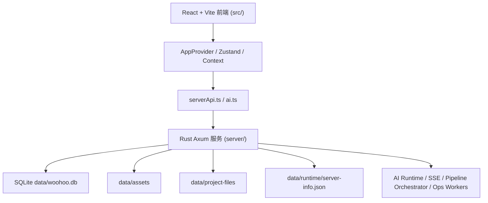
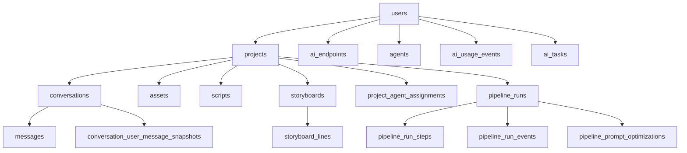
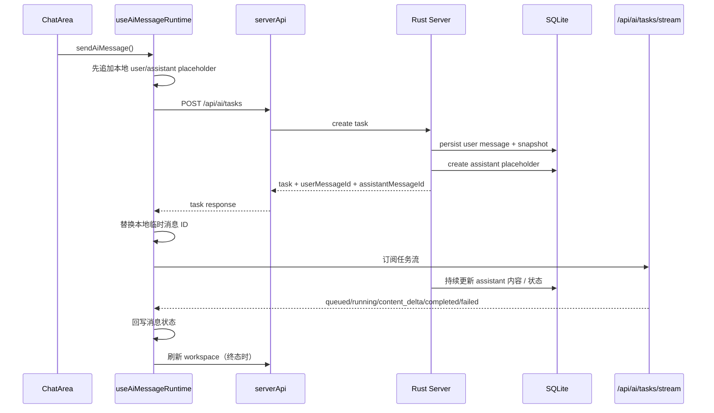
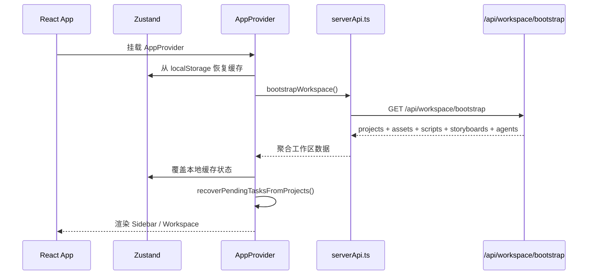
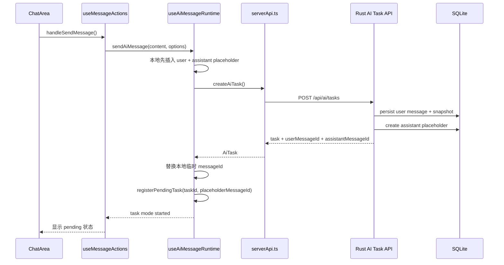
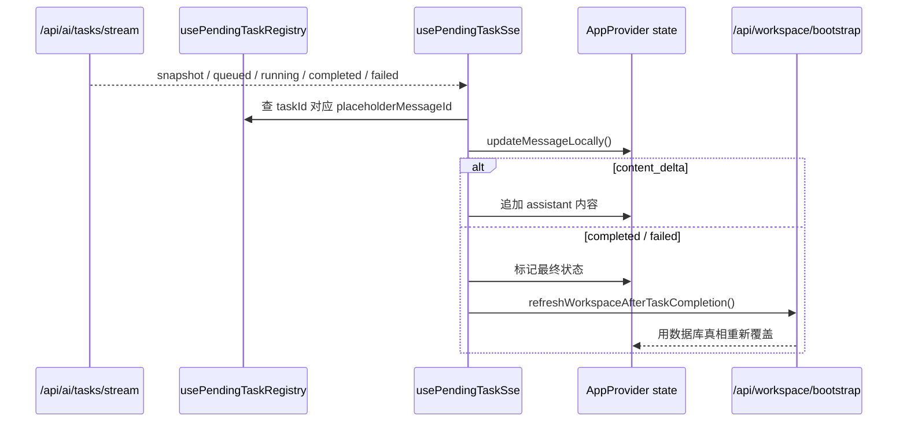
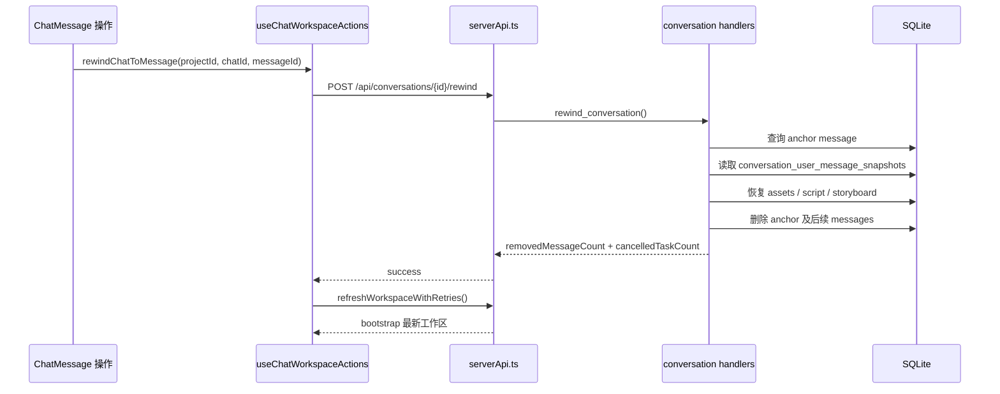
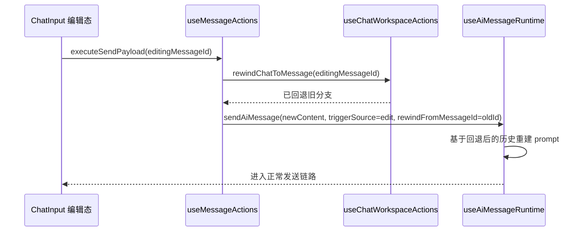
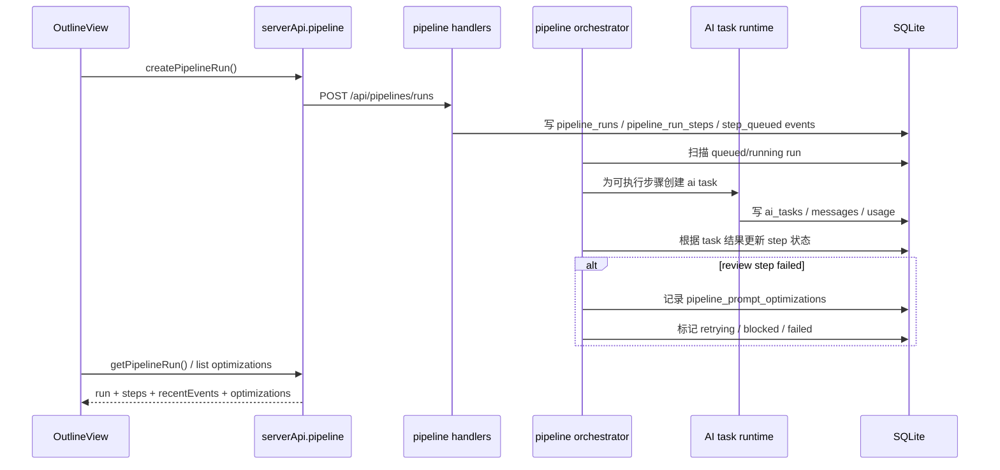

# Woohoo 当前系统架构说明

更新时间：2026-04-14

## 1. 适用范围

这份文档描述的是当前仓库里正在使用的主线架构，而不是历史原型。

- 前端主线：`src/`
- 后端主线：`server/`
- 桌面壳：`src-tauri/`
- 历史原型：`backend/`

当前真正被 `npm run dev:server` 和前端主链路调用的是 `server/`。`backend/` 只是保留中的旧原型，不是现行运行时。

## 2. 总体拓扑



可以把系统理解成三层：

- 表现层：React 页面、工作区 UI、设置与弹窗
- 应用层：AppProvider、业务 hooks、API 适配、任务订阅
- 持久化与编排层：Axum 路由、SQLite、AI 任务运行时、Pipeline Orchestrator、Ops Worker

## 3. 目录结构

主线目录可以按下面理解：

```text
.
├─ src/                         前端主代码
│  ├─ components/               跨域通用组件（Auth / Help / Settings / Toast / ErrorBoundary）
│  ├─ config/                   默认配置，如 defaultAgents
│  ├─ context/                  AppProvider、业务动作、SSE、bootstrap、持久化
│  ├─ features/studio/          Studio 主界面
│  │  └─ components/
│  │     ├─ chat/               对话区、输入区、消息分组、智能体弹窗
│  │     ├─ sidebar/            左侧项目/导航/设置入口
│  │     └─ workspace/          流程区、素材区、脚本/分镜/自动化/技能区
│  ├─ hooks/                    独立通用 hooks
│  ├─ lib/                      AI 请求、server API、上传、logger
│  ├─ mock/                     本地示例数据
│  ├─ store/                    Zustand 全局状态
│  ├─ styles/                   全局样式、Arco 样式入口
│  └─ types/                    前端领域模型
├─ server/                      Rust 后端主代码
│  ├─ src/
│  │  ├─ ai/                    AI 端点、智能体、任务、SSE、usage、策略审计
│  │  ├─ asset/                 资产 CRUD 和文件上传
│  │  ├─ auth/                  注册、登录、JWT、中间件
│  │  ├─ conversation/          对话、消息、撤回、编辑
│  │  ├─ ops/                   心跳、巡检、通知
│  │  ├─ pipeline/              流程运行、步骤、事件、编排器
│  │  ├─ project/               项目 CRUD
│  │  ├─ script/                剧本存取
│  │  ├─ storyboard/            分镜存取
│  │  ├─ workspace/             bootstrap 聚合接口
│  │  ├─ db.rs                  数据库初始化、迁移、兼容 backfill
│  │  └─ main.rs                入口、路由、后台 worker 启动
│  └─ migrations/               SQL 初始化与版本化 migration
├─ docs/                        架构、PRD、运维、回滚说明
├─ scripts/                     本地开发和回滚演练脚本
├─ data/                        SQLite、运行态文件、资产、演练数据
├─ src-tauri/                   桌面封装
└─ backend/                     已废弃的历史原型
```

几个关键判断：

- `src/features/studio/components` 是当前主界面的核心目录
- `src/context` 是前端真正的业务中枢
- `server/src/*` 按业务边界拆分，比传统 controller/service/repository 更贴近模块域
- `data/` 是运行时目录，不是源码目录

## 4. 核心数据模型

当前数据库的主干所有权关系可以简化为：



按职责可以分成几组：

- 账户与配置
  - `users`
  - `ai_endpoints`
  - `agents`
  - `project_agent_assignments`

- 创作主数据
  - `projects`
  - `conversations`
  - `messages`
  - `assets`
  - `scripts`
  - `storyboards`
  - `storyboard_lines`

- AI 运行态与审计
  - `ai_tasks`
  - `ai_usage_events`
  - `assistant_action_audits`
  - `user_ai_policies`

- 流程编排
  - `pipeline_runs`
  - `pipeline_run_steps`
  - `pipeline_run_events`
  - `pipeline_step_outputs`
  - `pipeline_prompt_optimizations`

- 运维与巡检
  - `runtime_heartbeats`
  - `notification_channels`
  - `notification_events`

几个需要特别注意的数据点：

- `messages` 是会话真相源，编辑、删除、撤回都围绕它展开
- `conversation_user_message_snapshots` 是撤回能力的关键，它把“某条用户消息发送前的项目资源状态”保存下来
- `ai_tasks` 是异步任务视图，不是完整消息真相源
- `ai_usage_events` 是用量、重试、redo、来源统计的台账表
- `pipeline_*` 是工作流层，不直接替代聊天消息，而是通过事件、总结和任务结果反映到聊天/工作区

## 5. 前端架构

### 5.1 状态层

前端不是单纯靠 Zustand，也不是单纯靠 Context，而是两者组合：

- `src/store/index.ts`
  - 保存基础状态快照
  - 包括项目、对话、资产、脚本、分镜、AI 设置、当前标签页、认证状态

- `src/context/AppContext.tsx`
  - 负责把“状态 + 副作用 + 服务端交互”组合成业务动作
  - 管理 workspace bootstrap、SSE、任务恢复、本地缓存、server endpoint 选择

- `src/context/appActionsContext.ts`
  - 对页面暴露统一动作接口
  - 页面不会直接自己拼复杂服务端调用链，而是调用 `sendAiMessage`、`rewindChatToMessage`、`saveStoryboard` 这类动作

当前模式可以理解成：

- Zustand：存数据和少量 UI 原子动作
- AppProvider：执行业务逻辑和 IO
- Feature 组件：消费状态、调用动作、渲染 UI

### 5.2 页面层

当前主界面入口是：

- `src/main.tsx`
  - React 挂载
  - `AppErrorBoundary`
  - Arco 样式入口

- `src/App.tsx`
  - 用 `AppProvider` 和 `ToastProvider` 包住应用
  - 渲染三种主状态：初始化中、未认证、已进入工作区

- `src/features/studio/components/sidebar/Sidebar.tsx`
  - 左侧项目与导航

- `src/features/studio/components/workspace/Workspace.tsx`
  - 主工作区
  - 根据 `currentTab` 切换到 chat / pipeline / assets / automation / skills / preview

### 5.3 业务 hooks

前端几个关键 hook 形成了实际业务主链路：

- `useWorkspaceBootstrap`
  - 首次调用 `/api/workspace/bootstrap`
  - 把项目、会话、消息、资产、脚本、分镜、agents 一次性 hydrate 到前端

- `useWorkspacePersistence`
  - 把前端状态落到 `localStorage`
  - 用于快速恢复 UI 和离线 warm start
  - 这里是缓存，不是最终真相源

- `useChatWorkspaceActions`
  - 对话、消息、资产、脚本、分镜相关动作
  - 包括消息删除、编辑、撤回、消息 ID 替换、服务端重试同步

- `useAiMessageRuntime`
  - 处理发消息的运行模式选择
  - 区分全局直连模式和项目内服务端任务模式

- `usePendingTaskRegistry`
  - 跟踪本地 pending task 和 placeholder message 的关系

- `usePendingTaskSse`
  - 订阅 `/api/ai/tasks/stream`
  - 实时把任务状态和增量内容回写到对应消息

## 6. 后端架构

### 6.1 入口与公共层

- `server/src/main.rs`
  - 环境变量加载
  - 端口探测和回退
  - runtime manifest 写入
  - 路由注册
  - CORS、安全检查、JWT 约束
  - 启动后台 worker

- `server/src/config.rs`
  - 集中读取运行配置

- `server/src/db.rs`
  - SQLite 连接池
  - SQL migration
  - Rust backfill migration
  - seed 与兼容修复报告

### 6.2 路由模块

后端模块基本与路由边界一致：

- `auth`
  - 注册、登录、`/api/auth/me`

- `workspace`
  - `/api/workspace/bootstrap`
  - 聚合项目、消息、素材、脚本、分镜、agents

- `project`
  - 项目 CRUD

- `conversation`
  - 对话 CRUD
  - 消息 CRUD
  - 用户消息撤回

- `asset`
  - 资产 CRUD
  - 本地文件上传和下载

- `script`
  - 项目主剧本 CRUD

- `storyboard`
  - 项目主分镜 CRUD

- `ai`
  - 端点管理
  - 智能体管理
  - 同步 AI 聊天
  - 流式聊天
  - 异步任务创建与 SSE
  - usage 汇总
  - 助理动作策略与审计

- `pipeline`
  - 流程 run 创建
  - run 详情与 stream
  - pause / resume / cancel / retry-step
  - 优化建议查询

- `ops`
  - 总览、心跳、finding、通知渠道、通知事件

### 6.3 后台 worker

服务启动后会并行拉起三类后台逻辑：

- `ops::monitor`
  - 记录心跳、巡检运行状态

- `ops::dispatcher`
  - 处理通知发送等运维分发任务

- `pipeline::orchestrator`
  - 定时推进 `pipeline_runs`
  - 根据步骤状态、依赖和审核结果继续调度

## 7. 关键数据流

### 7.1 启动与初始化

启动阶段的数据流是：

1. 前端挂载 `AppProvider`
2. 先从 `localStorage` 恢复缓存状态
3. 调用 `/api/workspace/bootstrap`
4. 用服务端返回的数据覆盖前端缓存
5. 恢复 pending task 映射
6. 如果未登录，则停止 loading，显示认证弹窗

这里的设计原则是：

- 本地缓存负责“快启动”
- 服务端 bootstrap 负责“校正真相”

### 7.2 全局对话

全局对话指没有进入项目上下文的聊天。

当前模式是：

- 前端直接调用 `src/lib/ai.ts` 里的 `requestAiCompletion`
- 浏览器直接按当前 AI 设置请求模型端点
- 消息只存在前端全局消息列表与本地缓存

这条链路的特点是：

- 轻量
- 不依赖服务端任务系统
- 不具备项目级资源引用、服务端任务恢复、SSE 持续同步那套能力

### 7.3 项目内对话

项目内对话是当前系统的主链路。



关键点：

- 用户消息先写库，再创建任务
- assistant 占位消息也先落库
- 前端拿到服务端真实 `messageId` 后会替换本地临时 ID
- SSE 用于实时更新
- 终态后再刷新一次 workspace，确保前端状态和数据库完全对齐

### 7.4 编辑、删除、撤回

消息修改链路和普通发送不同：

- 删除
  - 用户消息会带走它后面的 assistant 回复，直到下一个用户消息

- 编辑
  - 当前实现不是原地改历史，而是回退到目标用户消息，再按新内容重发

- 撤回
  - 只支持对用户消息撤回
  - 通过 `conversation_user_message_snapshots` 恢复当时的项目资源状态
  - 然后删除该条消息及其后续消息

这意味着撤回不是纯 UI 操作，而是“会话 + 项目资源”的联合回滚。

### 7.5 流程编排

`pipeline_runs` 走的是另一条更偏生产流程的链路：

1. 前端在 `OutlineView` 等页面创建 pipeline run
2. 后端插入 `pipeline_runs` 和 `pipeline_run_steps`
3. Orchestrator 定时扫描 queued/running run
4. 为可执行步骤创建 AI task
5. 根据步骤结果更新 step 状态
6. review 步骤会解析固定 JSON 审核结果
7. 审核失败时写入 `pipeline_prompt_optimizations`
8. 需要时进入自动重试、人工复核或终止

这条链路的特点是：

- step 有依赖关系
- 状态机比聊天更严格
- 有事件流和运行历史
- 人工复核已经接入前端工作台

### 7.6 服务重启恢复

AI 任务运行时是“内存运行 + 数据库存档”的混合模型：

- `ai_runtime` 在内存中调度和广播
- `ai_tasks` 会同步写入 SQLite
- 服务重启后会从 `ai_tasks` 恢复任务视图
- 启动时原本 queued/running 的任务会被统一标记为失败

这保证了：

- 前端不会无限等待旧任务
- 任务历史仍然能在数据库里追踪

## 8. 运行时文件与数据落点

当前运行时的重要文件位置：

- `data/woohoo.db`
  - SQLite 主数据库

- `data/assets`
  - 上传后的资产文件目录

- `data/project-files`
  - 项目级文件操作目录

- `data/runtime/server-info.json`
  - 当前服务实际 host / port / pid / healthUrl

- `data/runtime/usage-debug.log`
  - 调试级 usage 日志

- `data/rollback-drills/*`
  - 回滚演练快照、报告、跨版本演练数据

运行时真相源优先级可以理解成：

1. SQLite
2. 本地文件目录
3. 内存运行态
4. 浏览器 localStorage 缓存

## 9. 数据库迁移策略

当前数据库不是单靠 SQL migration，也不是单靠启动自修，而是混合方式：

- SQL migration
  - `001_init`
  - `002_pipeline_runs`
  - `003_pipeline_orchestrator_m1`
  - `004_pipeline_prompt_optimizations`
  - `008_ai_tasks_persistence`

- Rust backfill migration
  - `005_pipeline_schema_backfills`
  - `006_legacy_schema_backfills`
  - `007_runtime_compat_backfills_v2`
  - `009_ops_schema_conflict_backfills`
  - `010_agent_scope_backfills`
  - `011_updated_at_column_backfills`

当前策略重点是：

- 新库尽量靠 SQL 完整初始化
- 老库启动时通过 Rust backfill 自动补齐缺列、外键、索引和历史脏结构

## 10. 当前架构特点与边界

从现在的代码状态看，当前架构有几个很鲜明的特点：

- 本地优先
  - 默认数据库是本地 SQLite
  - 适合单机创作和桌面端工作流

- 前后端边界清晰，但不是传统前后端彻底分离
  - 前端全局聊天仍保留浏览器直连模型的路径
  - 项目内主链路已经转到服务端任务模式

- 工作区是聚合视图，不是单表直映
  - `/api/workspace/bootstrap` 会把项目、会话、消息、资产、脚本、分镜、agents 聚合成一个前端可直接消费的结构

- pipeline 与 chat 共用 AI 任务基础设施
  - 但 pipeline 额外叠加了步骤状态机、依赖、审核和事件流

- 兼容老库的成本仍然存在
  - 当前已做多轮 backfill 收口
  - 但架构上仍要接受“新库路径”和“旧库兼容路径”同时存在

当前边界也要明确：

- API 还没有 `/api/v1` 这类版本前缀
- 全局聊天和项目聊天仍是双模式，不是统一链路
- `backend/` 旧原型目录还在仓库里，容易误导新人
- `src-tauri/` 提供桌面封装，但当前主开发心智仍是“Vite 前端 + Rust 服务”

## 11. 关键 API 契约

这一节只列当前主链路最重要的接口，不展开所有字段。

### 11.1 工作区初始化

- `GET /api/workspace/bootstrap`
- 用途：前端登录后一次性拉取工作区主视图
- 主要响应结构：

```json
{
  "projects": [
    {
      "id": "project-id",
      "name": "项目名",
      "status": "draft",
      "phase": "ideation",
      "chatSessions": [
        {
          "id": "conversation-id",
          "projectId": "project-id",
          "title": "新对话",
          "messages": [
            {
              "id": "message-id",
              "role": "user|ai|system",
              "content": "消息内容",
              "timestamp": 1776000000000,
              "agentId": "optional",
              "model": "optional",
              "status": "done",
              "type": "text",
              "meta": {}
            }
          ],
          "updatedAt": 1776000000000
        }
      ],
      "agentRoster": [],
      "workflow": {},
      "assetsCount": 0,
      "createdAt": 1776000000000
    }
  ],
  "assets": [],
  "scripts": [],
  "storyboards": [],
  "agents": []
}
```

这条接口是前端状态纠偏入口，很多本地临时状态最终都靠它校准。

### 11.2 创建项目内 AI 任务

- `POST /api/ai/tasks`
- 用途：项目内对话主链路，创建异步 AI 任务
- 关键请求字段：

```json
{
  "conversationId": "conversation-id",
  "content": "用户输入",
  "resourceRefs": [],
  "agentId": "optional",
  "endpointId": "optional",
  "model": "optional",
  "systemPrompt": "optional",
  "temperature": 0.7,
  "maxTokens": 4096,
  "topP": 1,
  "frequencyPenalty": 0,
  "forceStreamFallback": true,
  "allowAssistantActions": false,
  "confirmedMessageId": null,
  "confirmedWorkflowGuardMessageId": null,
  "triggerSource": "normal|edit|rewind"
}
```

- 当前关键响应字段：

```json
{
  "id": "task-id",
  "projectId": "project-id",
  "conversationId": "conversation-id",
  "userMessageId": "persisted-user-message-id",
  "assistantMessageId": "persisted-assistant-placeholder-id",
  "status": "queued",
  "model": "gpt-4o-mini"
}
```

这里最重要的是：

- `userMessageId`
  - 用来把前端本地临时 user message 替换成服务端真实 ID

- `assistantMessageId`
  - 用来把前端 placeholder assistant message 替换成服务端真实 ID

这两个字段直接决定后续撤回、编辑、删除是否能命中数据库里的真实消息。

### 11.3 AI 任务 SSE

- `GET /api/ai/tasks/stream`
- 用途：推送异步任务状态和内容增量
- 当前事件模型：

```text
event: snapshot
data: { "tasks": [...] }

event: queued|running|completed|failed|context|lagged
data: {
  "eventType": "running",
  "task": { ...AiTask },
  "contentDelta": "optional"
}
```

前端实际依赖的字段是：

- `task.id`
- `task.projectId`
- `task.conversationId`
- `task.status`
- `task.result`
- `task.error`
- `contentDelta`

### 11.4 对话撤回

- `POST /api/conversations/{id}/rewind`
- 用途：回退某条用户消息及其后续内容，并恢复当时的项目资源状态
- 请求体：

```json
{
  "messageId": "anchor-user-message-id",
  "assetsOnly": true
}
```

- 响应体：

```json
{
  "conversationId": "conversation-id",
  "anchorMessageId": "anchor-user-message-id",
  "removedMessageCount": 3,
  "cancelledTaskCount": 1
}
```

约束：

- 只支持用户消息作为锚点
- 锚点必须在数据库 `messages` 里存在
- 锚点还必须有对应的 `conversation_user_message_snapshots`

### 11.5 消息编辑

- `PUT /api/conversations/{id}/messages/{message_id}`
- 用途：更新消息文本
- 请求体：

```json
{
  "content": "新的内容"
}
```

但前端当前主路径里的“编辑消息”并不依赖它来实现完整语义。现在的实际行为是：

- 先 rewind 到目标用户消息
- 再按新内容重新发送

所以这个接口更像低层能力，不是主 UX 的完整编辑闭环。

### 11.6 流程运行创建

- `POST /api/pipelines/runs`
- 用途：创建一个流程 run，并初始化步骤
- 请求体主干：

```json
{
  "projectId": "project-id",
  "conversationId": "conversation-id",
  "pipelineType": "outline",
  "triggerSource": "manual",
  "betaEnabled": true,
  "idempotencyKey": "outline-xxx",
  "steps": [
    {
      "stepKey": "outline_design",
      "stepName": "大纲设计",
      "stepOrder": 1,
      "stepType": "design",
      "dependsOn": [],
      "reviewPolicy": {},
      "maxRetries": 2,
      "promptTemplate": "..."
    }
  ]
}
```

这里有两个关键特征：

- run 级有 `idempotencyKey`
- step 级有 `dependsOn / reviewPolicy / maxRetries / promptTemplate`

### 11.7 流程详情与人工复核相关接口

- `GET /api/pipelines/runs/{id}`
  - 返回 `run + steps + recentEvents`

- `GET /api/pipelines/runs/{id}/optimizations`
  - 返回 `pipeline_prompt_optimizations`

- `POST /api/pipelines/runs/{id}/pause`
- `POST /api/pipelines/runs/{id}/resume`
- `POST /api/pipelines/runs/{id}/cancel`
- `POST /api/pipelines/runs/{id}/retry-step`

这一组接口对应当前 `OutlineView` 的控制台。

### 11.8 资产上传

- `POST /api/projects/{project_id}/assets/upload`
- 用途：上传本地文件，写入资产记录
- 形式：`multipart/form-data`
- 当前约束：
  - 扩展名白名单
  - 单文件大小限制
  - 项目级数量限制
  - 用户级总容量限制

上传成功后：

- 文件写到 `data/assets`
- 资产元数据写入 `assets`
- 前端通过 `/api/assets/{id}/file` 访问本地文件

## 12. 核心调用链时序

### 12.1 应用启动与工作区初始化



### 12.2 项目内发消息主链路



### 12.3 任务 SSE 回写链路



### 12.4 用户消息撤回链路



如果首发使用了临时 message ID：

- 前端会先尝试用当前 ID 调用
- 若服务端返回 not found
- 会刷新 workspace，并按消息内容/角色做一次服务端消息匹配兜底

### 12.5 编辑消息链路



所以当前“编辑”本质是：

- 历史回退
- 新分支重发

而不是传统 IM 的原地改文本。

### 12.6 Outline 流程编排链路



## 13. 开发者阅读顺序

如果是第一次接这个仓库，建议不要从某个零散页面直接钻进去，而是按下面顺序读。

### 13.1 先建立整体运行心智

1. [package.json](/C:/Users/lxy/Desktop/work/woohoo/package.json:1)
   看当前真正的启动脚本、构建脚本、测试脚本。

2. [src/main.tsx](/C:/Users/lxy/Desktop/work/woohoo/src/main.tsx:1)
   看前端根入口、错误边界、样式入口。

3. [src/App.tsx](/C:/Users/lxy/Desktop/work/woohoo/src/App.tsx:1)
   看应用壳如何在“初始化中 / 未认证 / 已进入工作区”之间切换。

4. [server/src/main.rs](/C:/Users/lxy/Desktop/work/woohoo/server/src/main.rs:1)
   看后端入口、路由注册、worker 启动、runtime manifest。

### 13.2 再看前端业务中枢

1. [src/store/index.ts](/C:/Users/lxy/Desktop/work/woohoo/src/store/index.ts:1)
   先知道前端到底持有哪些核心状态。

2. [src/context/AppContext.tsx](/C:/Users/lxy/Desktop/work/woohoo/src/context/AppContext.tsx:1)
   这是前端主中枢，理解大多数跨模块行为都离不开这里。

3. [src/context/hooks/useWorkspaceBootstrap.ts](/C:/Users/lxy/Desktop/work/woohoo/src/context/hooks/useWorkspaceBootstrap.ts:1)
   看工作区初始化怎么从服务端 hydrate。

4. [src/context/hooks/useWorkspacePersistence.ts](/C:/Users/lxy/Desktop/work/woohoo/src/context/hooks/useWorkspacePersistence.ts:1)
   看哪些状态会写入本地缓存。

5. [src/context/hooks/useChatWorkspaceActions.ts](/C:/Users/lxy/Desktop/work/woohoo/src/context/hooks/useChatWorkspaceActions.ts:1)
   看消息编辑、删除、撤回、脚本/分镜/资产动作的真正执行链。

6. [src/context/hooks/useAiMessageRuntime.ts](/C:/Users/lxy/Desktop/work/woohoo/src/context/hooks/useAiMessageRuntime.ts:1)
   看全局聊天和项目内聊天为什么是两条链路，以及任务模式怎么接入。

7. [src/context/hooks/usePendingTaskSse.ts](/C:/Users/lxy/Desktop/work/woohoo/src/context/hooks/usePendingTaskSse.ts:1)
   看任务 SSE 如何把服务端状态实时映射回消息 UI。

### 13.3 然后看主界面组件

1. [src/features/studio/components/sidebar/Sidebar.tsx](/C:/Users/lxy/Desktop/work/woohoo/src/features/studio/components/sidebar/Sidebar.tsx:1)
   看左侧项目、会话、导航怎么组织。

2. [src/features/studio/components/workspace/Workspace.tsx](/C:/Users/lxy/Desktop/work/woohoo/src/features/studio/components/workspace/Workspace.tsx:1)
   看主工作区如何切 tab。

3. [src/features/studio/components/chat/ChatArea.tsx](/C:/Users/lxy/Desktop/work/woohoo/src/features/studio/components/chat/ChatArea.tsx:1)
   看聊天主页面。

4. [src/features/studio/components/chat/hooks/useMessageActions.ts](/C:/Users/lxy/Desktop/work/woohoo/src/features/studio/components/chat/hooks/useMessageActions.ts:1)
   看用户交互怎么落到 `AppActions`。

5. [src/features/studio/components/workspace/PipelineSteps/OutlineView.tsx](/C:/Users/lxy/Desktop/work/woohoo/src/features/studio/components/workspace/PipelineSteps/OutlineView.tsx:1)
   看当前最完整的 pipeline 前端工作台。

### 13.4 后端按“入口 -> 聚合 -> 专项”顺序读

1. [server/src/db.rs](/C:/Users/lxy/Desktop/work/woohoo/server/src/db.rs:1)
   先理解 migration、backfill、seed、兼容策略。

2. [server/src/workspace/handlers.rs](/C:/Users/lxy/Desktop/work/woohoo/server/src/workspace/handlers.rs:1)
   这是前端 bootstrap 的聚合真相源，很适合建立数据总览。

3. [server/src/conversation/repo.rs](/C:/Users/lxy/Desktop/work/woohoo/server/src/conversation/repo.rs:1)
   看消息、新增快照、撤回、编辑的数据库真逻辑。

4. [server/src/ai/handlers.rs](/C:/Users/lxy/Desktop/work/woohoo/server/src/ai/handlers.rs:1)
   看 AI 同步调用、任务创建、流式执行、失败收尾。

5. [server/src/ai/handlers/chat_core.rs](/C:/Users/lxy/Desktop/work/woohoo/server/src/ai/handlers/chat_core.rs:1)
   看用户消息持久化、assistant 占位和最终消息是怎么写库的。

6. [server/src/ai/task_handlers.rs](/C:/Users/lxy/Desktop/work/woohoo/server/src/ai/task_handlers.rs:1)
   看任务查询、取消、SSE。

7. [server/src/pipeline/handlers.rs](/C:/Users/lxy/Desktop/work/woohoo/server/src/pipeline/handlers.rs:1)
   看流程 run 的接口层。

8. [server/src/pipeline/orchestrator.rs](/C:/Users/lxy/Desktop/work/woohoo/server/src/pipeline/orchestrator.rs:1)
   看步骤调度、review、retry、prompt optimization 的核心状态机。

### 13.5 最后再看辅助层

1. [src/lib/serverApi.ts](/C:/Users/lxy/Desktop/work/woohoo/src/lib/serverApi.ts:1)
   看前端如何映射后端接口和数据结构。

2. [src/lib/ai.ts](/C:/Users/lxy/Desktop/work/woohoo/src/lib/ai.ts:1)
   看浏览器直连模型调用和流式 fallback 逻辑。

3. [server/src/config.rs](/C:/Users/lxy/Desktop/work/woohoo/server/src/config.rs:1)
   看运行时配置面。

4. [docs/architecture-governance-prd-tdd.md](/C:/Users/lxy/Desktop/work/woohoo/docs/architecture-governance-prd-tdd.md:1)
   看当前 PRD 和已完成/未完成项。

5. [docs/current-system-architecture.md](/C:/Users/lxy/Desktop/work/woohoo/docs/current-system-architecture.md:1)
   最后回来看这份文档，校准整体理解。

### 13.6 一句话阅读策略

不要按“目录名看起来像什么”去猜，要按这条顺序：

- 入口
- 状态中枢
- 主界面
- 聚合接口
- 专项模块
- 最后才是工具层和历史文档

## 14. 一句话总结

当前 Woohoo 的主架构可以概括为：

一个以 `server/` Rust + SQLite 为真相源、以 `src/` React 工作区为操作面、以 AI 任务运行时和 Pipeline Orchestrator 为中枢编排层的本地优先创作系统。
