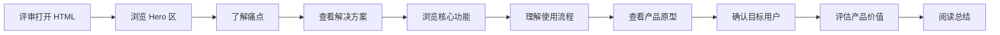

# Woohoo Studio 创意方案展示页 PRD

## 1. 产品概述

Woohoo Studio 是面向「TRAE AI 创造力大赛」学习工作赛道的创意方案展示页面。这是一个单文件 HTML 展示页，用于向评审清晰呈现项目创意、目标用户、痛点、核心功能、使用流程和产品价值。本页面不是可运行产品，而是轻量级的产品原型示意 + 创意提案展示页。

**核心目的**：让评审在 3-5 分钟内快速理解 Woohoo Studio 的产品定位、创新点和商业价值。

## 2. 核心功能模块

### 2.1 页面结构（9 大模块）

| 模块序号 | 模块名称 | 核心内容 |
|---------|---------|---------|
| 1 | Hero 区 | 产品名称、副标题、一句话介绍、赛道标签、关键词标签、产品界面示意图 |
| 2 | 为什么需要它 | 4 张痛点卡片：创意难落地 / 工具太分散 / 分镜剧本门槛高 / 素材版本难管理 |
| 3 | 产品如何解决 | 核心解决方案展示：一个工作台 / 多个 AI 智能体 / 一条制作流水线 / 一个素材库 / 一键导出 |
| 4 | 核心功能 | 8 个功能网格卡片：创意对话 / 多智能体协作 / 大纲生成 / 剧本生成 / 人物场景设定 / 关键帧规划 / AI 图片生成 / 素材库与导出 |
| 5 | 使用流程 | 流程图：输入创意 → AI 协作 → 生成大纲 → 生成剧本 → 拆解分镜 → 生成素材 → 预览导出 |
| 6 | 产品原型示意 | HTML/CSS 绘制的工作台界面原型（左侧项目列表 / 中间 AI 对话区 / 右侧制作流程面板） |
| 7 | 目标用户 | 5 类用户卡片：短视频创作者 / 学生团队 / 自媒体运营者 / 影视动画爱好者 / 小型工作室 |
| 8 | 价值与意义 | 四维度价值说明：效率 / 创作 / 协作 / 商业 |
| 9 | 总结 | 有感染力的总结文案 |

### 2.2 交互需求

- **导航锚点**：顶部固定导航栏，点击跳转到各模块
- **Hover 效果**：功能卡片 hover 时有微动效（阴影加深、轻微上浮）
- **流程高亮**：流程步骤 hover 时高亮显示
- **原型切换**：产品原型中点击不同流程步骤时，右侧内容区域切换显示对应内容

## 3. 核心用户流程

## 4. 用户界面设计

### 4.1 设计风格

**整体调性**：现代科技感、专业但不花哨、适合 AI 创作工具

**配色方案**：
- **主背景**：深色渐变背景（#0a0e1a → #1a1f35）
- **主色调**：青蓝色系（#00d4ff, #0099ff）
- **辅助色**：紫色点缀（#8b5cf6）
- **文字色**：主文字 #ffffff，次文字 #94a3b8
- **卡片背景**：半透明深色 rgba(255,255,255,0.05) + 边框 rgba(255,255,255,0.1)

**字体方案**：
- **标题字体**：系统默认无衬线字体（优先使用 -apple-system, BlinkMacSystemFont）
- **正文字体**：系统默认无衬线字体
- **代码/技术字体**：monospace

**布局风格**：
- 卡片式布局，圆角 12px
- 克制的阴影效果
- 充足的留白和层次感
- 渐变和微光效果增加科技感

### 4.2 响应式设计

- **桌面端（>1024px）**：宽屏布局，Hero 区左右分栏，功能卡片 4 列网格
- **平板端（768px-1024px）**：中等宽度，功能卡片 2-3 列
- **手机端（<768px）**：单列堆叠布局，所有模块垂直排列

### 4.3 动效规范

- **入场动画**：各模块滚动进入视口时有淡入 + 轻微上移动画
- **Hover 效果**：卡片 hover 时 transform: translateY(-4px)，box-shadow 增强
- **流程步骤**：hover 时边框发光 + 背景高亮
- **过渡时间**：200-300ms ease-out

## 5. 技术约束

- 单文件 HTML，CSS 和 JS 内联
- 不依赖外部图片资源
- 不依赖外部 CSS/JS 框架
- 所有界面元素用 HTML/CSS 绘制
- 文件保存后可直接浏览器打开
