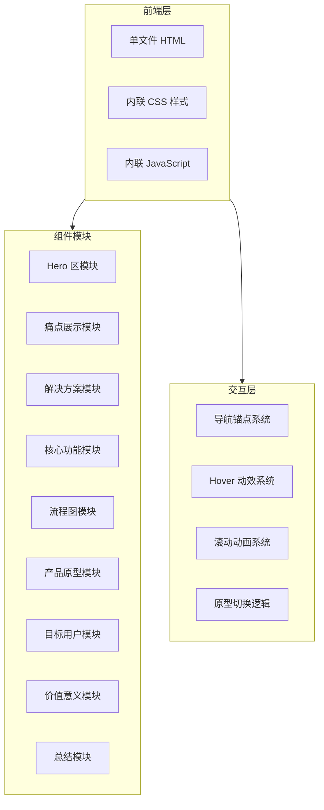

# Woohoo Studio 创意方案展示页 技术架构文档

## 1. 架构设计



## 2. 技术选型

### 2.1 前端技术栈

| 技术 | 版本/规格 | 用途 |
|------|----------|------|
| HTML5 | - | 页面结构 |
| CSS3 | - | 样式、动画、响应式布局 |
| JavaScript (ES6+) | - | 交互逻辑、DOM 操作 |

### 2.2 核心技术特性

- **纯原生实现**：不依赖任何第三方框架或库
- **CSS Grid + Flexbox**：现代化布局系统
- **CSS Variables**：主题色彩管理
- **CSS Animations**：流畅的动画效果
- **Intersection Observer API**：滚动触发动画
- **Responsive Design**：媒体查询实现响应式

## 3. 文件结构

```
woohoo-studio-proposal.html  (单文件)
├── <head>
│   ├── <meta> 标签（SEO、视口配置）
│   ├── <style>（全部 CSS 样式）
│   │   ├── CSS Variables（主题变量）
│   │   ├── Reset / Base Styles
│   │   ├── Layout Styles（布局）
│   │   ├── Component Styles（组件样式）
│   │   ├── Animation Styles（动画）
│   │   └── Responsive Styles（响应式）
│   └── <title>
├── <body>
│   ├── <nav>（固定导航栏）
│   ├── <section id="hero">（Hero 区）
│   ├── <section id="pain-points">（痛点）
│   ├── <section id="solution">（解决方案）
│   ├── <section id="features">（核心功能）
│   ├── <section id="workflow">（使用流程）
│   ├── <section id="prototype">（产品原型）
│   ├── <section id="users">（目标用户）
│   ├── <section id="value">（价值意义）
│   ├── <section id="summary">（总结）
│   └── <script>（全部 JavaScript）
│       ├── 导航平滑滚动
│       ├── 滚动动画触发
│       ├── 原型切换逻辑
│       └── Hover 效果增强
```

## 4. 关键实现细节

### 4.1 产品原型界面（第六部分）

使用 HTML/CSS 绘制模拟的工作台界面：

**左侧边栏**：
- Logo 区域
- 项目列表（3-4 个示例项目）
- 底部设置按钮

**中间主区域**：
- 顶部：项目名称 + 操作按钮
- 对话区域：AI 消息气泡（用户消息 + AI 回复）
- 底部：输入框 + 发送按钮

**右侧面板**：
- 制作流水线步骤列表（可点击切换）
- 当前步骤详情内容区

**底部素材区**：
- 素材卡片横向排列（图片、视频、文档图标）

### 4.2 动画系统

```javascript
// 使用 Intersection Observer 实现滚动触发动画
const observer = new IntersectionObserver((entries) => {
  entries.forEach(entry => {
    if (entry.isIntersecting) {
      entry.target.classList.add('visible');
    }
  });
}, { threshold: 0.1 });

// 为每个 section 添加观察
document.querySelectorAll('section').forEach(section => {
  observer.observe(section);
});
```

### 4.3 响应式断点

| 断点 | 宽度范围 | 布局调整 |
|------|---------|---------|
| Desktop | > 1200px | 完整宽屏布局 |
| Tablet | 768px - 1200px | 中等宽度，2-3列网格 |
| Mobile | < 768px | 单列堆叠布局 |

## 5. 性能优化

- **CSS 优化**：使用 CSS 变量减少重复代码，合理使用 will-change 属性
- **动画优化**：只对 transform 和 opacity 做动画，避免触发重排
- **图片替代**：所有视觉元素用 CSS/SVG 实现，无外部资源加载
- **代码压缩**：保持代码简洁，避免冗余选择器

## 6. 浏览器兼容性

- Chrome 80+
- Firefox 75+
- Safari 13+
- Edge 80+
- 移动端浏览器（iOS Safari, Chrome Mobile）

## 7. 文件大小预估

- HTML 结构：~15KB
- CSS 样式：~25KB
- JavaScript：~5KB
- **总计：约 45KB**（未压缩）
